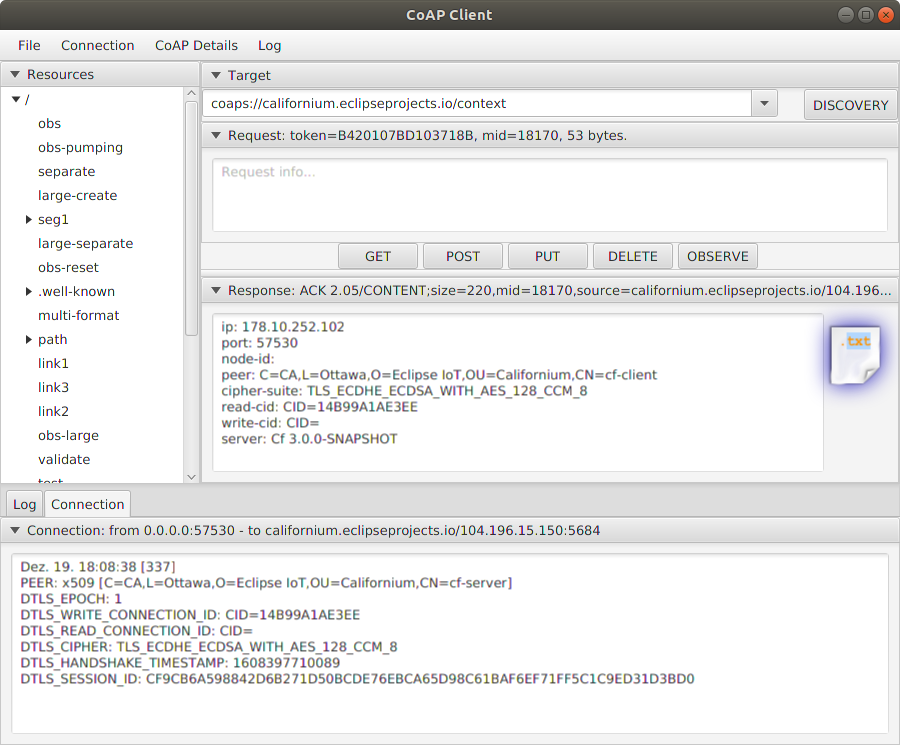

# Cf-Browser

A JavaFX application that uses the Californium libraries to act as `coap-client` to discover and interact with `coap-servers`.



## Prerequisite

Unfortunately `javaFX` was only a short time part of the java-JRE/JDK releases, mainly for oracle's java 1.7 and java 1.8. For openjdk's and since java 11 it's required to be installed as separate SDK, specific to the java-JRE/JDK used.

See [JavaFX/openJFX](https://openjfx.io/openjfx-docs/) for general information around JavaFX.
Downloads are available from [Gluon](https://gluonhq.com/products/javafx/) or for openjfx 11 as artifacts in maven central.

For Ubuntu or other linux distributions, there are also packages available.

```sh
sudo apt install openjfx
```

Note: 

Using different versions of `java` and `javafx` fails, ensure you use a proper pair.

Note:

The Cf-browser runs with oracle-jdk-8, for which it was initially developed.
Using other versions, including openjdk-8 requires to use libraries, which as for now (October 2020) requires the license-check to be done. That check is pending for openjfx 11. If you use it, please ensure, that you check the licenses of the used javaFX on your own.

## Build

oracle-jdk-8 or openjdk-11:

Just use mvn to build it, as usual.

```sh
mvn clean install
```

Using openjdk-8 instead of oracle-jdk-8 requires to install openjfx-8 ahead. See [Stackoverflow](https://askubuntu.com/questions/1137891/how-to-install-run-java-8-and-javafx-on-ubuntu-18-04)

```sh
sudo apt install \
  openjfx=8u161-b12-1ubuntu2 \
  libopenjfx-java=8u161-b12-1ubuntu2 \
  libopenjfx-jni=8u161-b12-1ubuntu2
```

and 

```sh
sudo apt-mark hold \
  openjfx \
  libopenjfx-java \
  libopenjfx-jni
```

to prevent further updates, though the current recommended version is for java 11.

Note: The binary artifact created in the target folder does not contain any JavaFX classes.
Please make sure that JavaFX is available from your system class path before running the application.

## Run

java-8:

```sh
java -jar cf-browser-2.5.0.jar
```

java-11 (module-path of Ubuntu 18.04):

```sh
java --module-path /usr/share/openjfx/lib --add-modules javafx.controls,javafx.fxml -jar cf-browser-2.5.0.jar
```

Alternatively, when using Java 11 or later, the application can be started from the
source folder using

```sh
mvn javafx:run
```

## Arguments

```sh
Usage: GUIClientFX [-hvV] [--help-auth] [--help-cipher]
                   [--cid-length=<cidLength>] [-i=<identity>]
                   [--local-port=<localPort>] [--mtu=<mtu>] [-N=FILE]
                   [--proxy=<proxy>] [--psk-index=<pskIndex>]
                   [--psk-store=<pskStore>] [--record-size=<recordSizeLimit>]
                   [-a=<authenticationModes>[:<authenticationModes>...]]...
                   [--cipher=<cipherSuites>[:<cipherSuites>...]]...
                   [-c=<credentials> | --anonymous] [-t=<trusts>
                   [-t=<trusts>]... | --trust-all] [-s=<text> |
                   --secrethex=<hex> | --secret64=<base64>] [URI]
      [URI]                  destination URI. Default californium.eclipse.org
  -a, --auth=<authenticationModes>[:<authenticationModes>...]
                             use authentikation modes. '--help-auth' to list
                               available authentication modes.
      --anonymous            anonymous, no certificate.
  -c, --cert=<credentials>   certificate store. Format
                               keystore#hexstorepwd#hexkeypwd#alias or keystore.
                               pem
      --cid-length=<cidLength>
                             Use cid with length. 0 to support cid only without
                               using it.
      --cipher=<cipherSuites>[:<cipherSuites>...]
                             use ciphersuites. '--help-cipher' to list
                               available cipher suites.
  -h, --help                 display a help message
      --help-auth            display a help message for authentication modes
      --help-cipher          display a help message for cipher suites
  -i, --identity=<identity>  PSK identity
      --local-port=<localPort>
                             local porty. Default ephemeral port.
      --mtu=<mtu>            MTU.
  -N, --netconfig=FILE       network config file. Default Californium.
                               properties.
      --proxy=<proxy>        use proxy. <address>:<port>[:<scheme>]. Default
                               env-value of COAP_PROXY.
      --psk-index=<pskIndex> Index of identity in PSK store. Starts at 0.
      --psk-store=<pskStore> PSK store. Lines format: identity=secretkey (in
                               base64).
      --record-size=<recordSizeLimit>
                             record size limit.
  -s, --secret=<text>        PSK secret, utf8
      --secret64=<base64>    PSK secret, base64
      --secrethex=<hex>      PSK secret, hexadecimal
  -t, --trusts=<trusts>      trusted certificates. Format
                               keystore#hexstorepwd#alias or truststore.pem
      --trust-all            trust all valid certificates.
  -v, --[no-]verbose         verbose
  -V, --version              display version info
```
